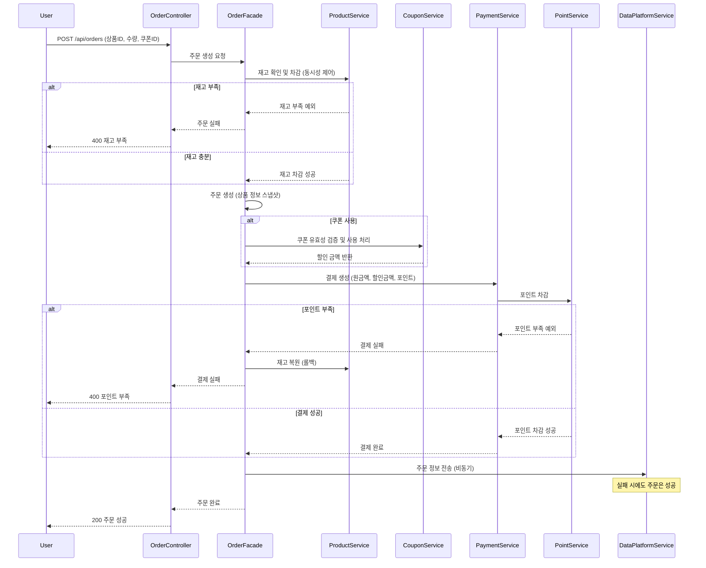
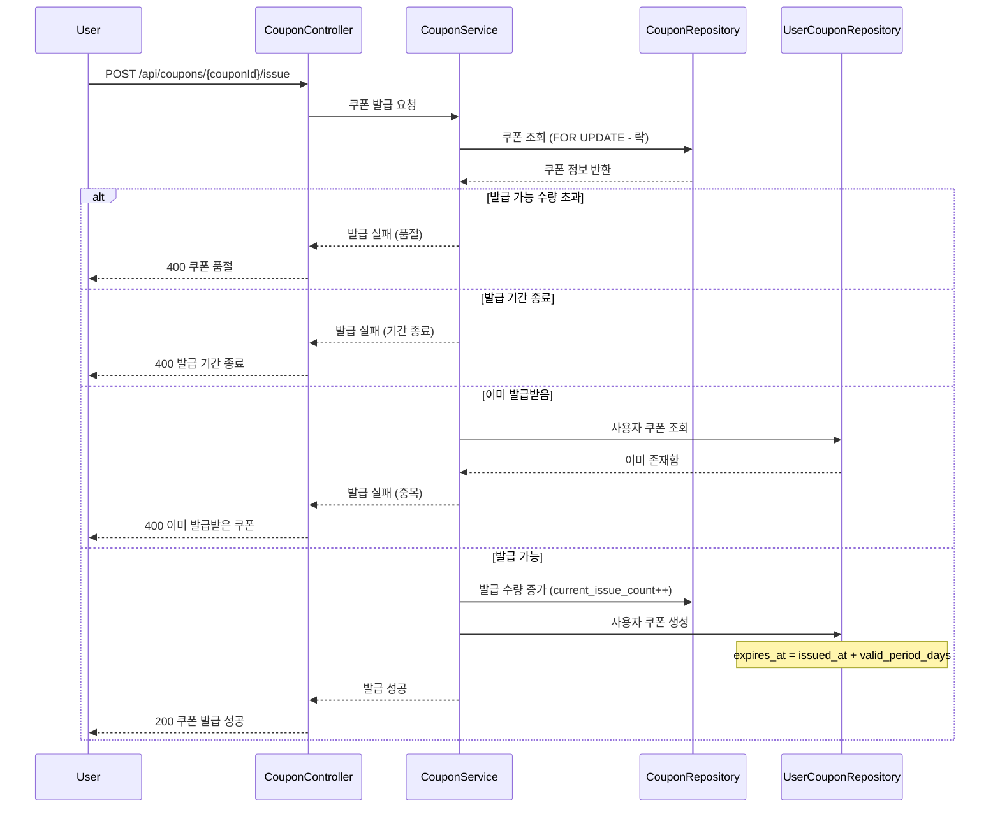
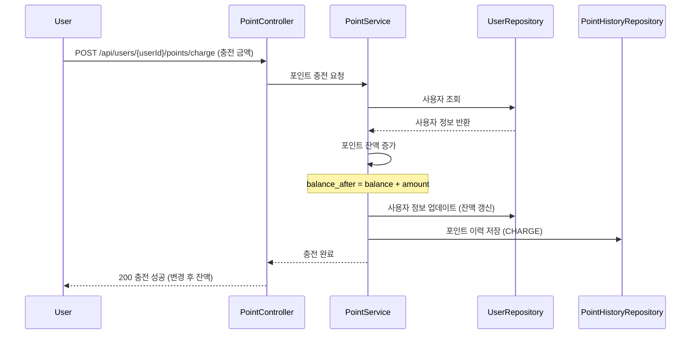
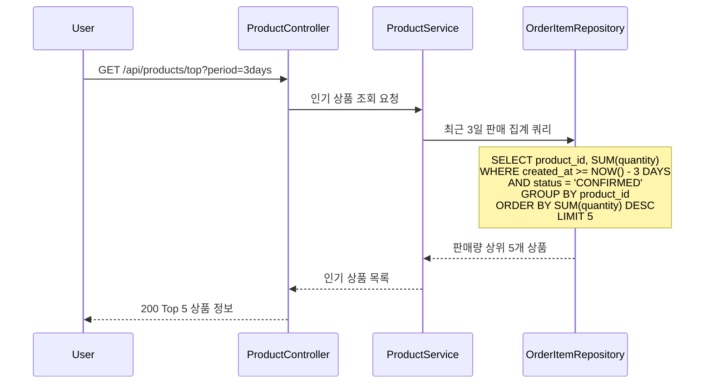

# 시퀀스 다이어그램

## 📋 목차
1. [주문 생성 및 결제 처리](#1-주문-생성-및-결제-처리)
2. [선착순 쿠폰 발급](#2-선착순-쿠폰-발급)
3. [포인트 충전](#3-포인트-충전)
4. [최근 3일 인기 상품 조회](#4-최근-3일-인기-상품-조회)

---

## 1. 주문 생성 및 결제 처리

> 핵심 비즈니스 로직: 재고 차감 → 쿠폰 적용 → 포인트 사용 → 결제 처리 → 외부 전송



### 주요 처리 흐름
1. **재고 확인 및 차감**: 동시성 제어를 통해 재고 수량 검증 및 차감
2. **주문 생성**: 상품 정보(이름, 가격)를 스냅샷으로 저장
3. **쿠폰 적용**: 쿠폰 유효성 검증 후 할인 금액 계산
4. **결제 처리**: 포인트 차감 및 결제 완료
5. **외부 전송**: 비동기로 데이터 플랫폼에 전송 (실패해도 주문 성공)

### 예외 처리
- 재고 부족 시 주문 실패
- 포인트 부족 시 재고 복원 후 결제 실패
- 외부 전송 실패는 주문에 영향 없음

---

## 2. 선착순 쿠폰 발급

> 핵심 비즈니스 로직: 동시성 제어를 통한 선착순 발급



### 주요 처리 흐름
1. **동시성 제어**: 비관적 락(FOR UPDATE) 또는 낙관적 락으로 선착순 보장
2. **발급 가능 검증**: 수량, 기간, 중복 발급 체크
3. **쿠폰 발급**: 발급 수량 증가 및 사용자 쿠폰 생성
4. **만료일 계산**: 발급일 + 유효기간(일)

### 예외 처리
- 발급 수량 초과 시 품절 응답
- 발급 기간이 아닐 경우 실패
- 이미 발급받은 사용자는 중복 발급 불가

---

## 3. 포인트 충전

> 핵심 비즈니스 로직: 포인트 충전 및 이력 관리



### 주요 처리 흐름
1. **사용자 조회**: 충전 대상 사용자 확인
2. **포인트 증가**: 현재 잔액 + 충전 금액
3. **이력 저장**: transaction_type='CHARGE', balance_after 기록
4. **응답 반환**: 변경 후 잔액 정보 반환

---

## 4. 최근 3일 인기 상품 조회

> 핵심 비즈니스 로직: 통계 쿼리 최적화



### 주요 처리 흐름
1. **기간 필터링**: 최근 3일 데이터만 조회
2. **상태 필터링**: 결제 완료(CONFIRMED)된 주문만 집계
3. **집계 쿼리**: 상품별 판매 수량 합계
4. **정렬 및 제한**: 판매량 내림차순 상위 5개

### 인덱스 최적화
```sql
CREATE INDEX idx_order_items_stats 
ON order_items(created_at, status, product_id);
```

---


### 시퀀스 다이어그램 작성 기준
1. **복잡도**: 여러 서비스가 협력하는 플로우
2. **동시성**: 동시 요청 처리가 필요한 기능
3. **트랜잭션**: 롤백 등 예외 처리가 중요한 플로우
4. **비즈니스 중요도**: 핵심 기능 위주

---

## 🔍 참고 사항

### Facade 패턴 사용
- 여러 서비스를 조율하는 복잡한 플로우는 Facade 사용
- 예: `OrderFacade`가 상품, 쿠폰, 결제, 포인트 서비스 조율

### 비동기 처리 표현
- 외부 데이터 전송은 비동기로 처리
- 실패해도 주문 성공에 영향 없음

### 예외 처리 명시
- alt/else 블록으로 예외 상황 표현
- 롤백이 필요한 경우 명시적으로 표시